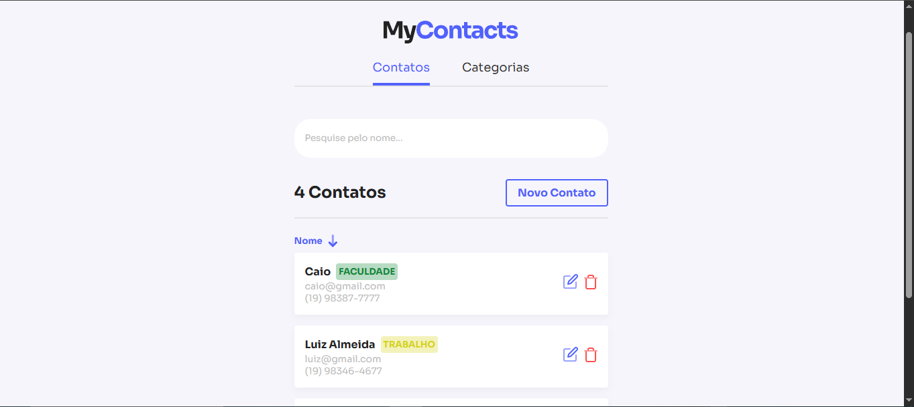

<h1 align="center">
  
</h1>

## 📖 Sobre o projeto

**MyContacts** é uma aplicação fullstack construída com JavaScript que simula uma agenda de contatos.

Você pode criar, editar, deletar e categorizar contatos, com uma interface intuitiva e responsiva.

O projeto utiliza:

- **React.js** no front-end
- **Node.js + Express** no back-end
- **PostgreSQL** como banco de dados
- Tudo containerizado com **Docker**

---

## 🧪 Tecnologias

[](https://skillicons.dev)

---

## 🚀 Rodando o projeto

```bash
# Clone o repositório
git clone https://github.com/Luiz-1213/mycontacts
cd mycontacts
```

### 🐳 Subindo containers com Docker

```bash
# Inicie o banco de dados
docker-compose up -d
```

> O Docker irá subir um container com PostgreSQL e já aplicar o schema inicial no banco.

---

### 🧩 Instalando dependências

#### Front-end

```bash
cd frontend
npm install
# ou
yarn
```

#### Back-end

```bash
cd api
npm install
# ou
yarn
```

---

### 💻 Executando o projeto localmente

> Certifique-se de que o banco está rodando (via Docker).

#### Inicie o back-end

```bash
cd api
yarn dev
```

#### Inicie o front-end

```bash
cd fe
yarn start
```

---

## ⚙️ Variáveis de Ambiente

Crie um arquivo `.env` no diretório `api` com as seguintes variáveis:

```env
DB_HOST=localhost
DB_PORT=5432
DB_USER=root
DB_PASS=root
DB_NAME=mycontacts
```

No front-end (`frontend`), crie:

```env
REACT_APP_API_URL=http://localhost:3333
```

---

## 📝 Licença

Este projeto está sob a licença [MIT](https://rem.mit-license.org).
